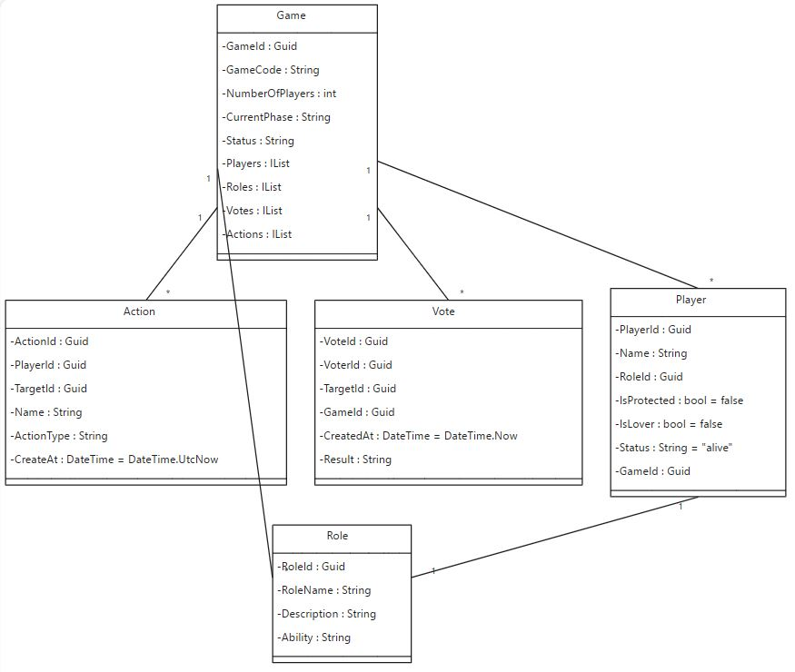

# LoupGarou

# Werewolf Game Project Overview

## Game Description
- **Title**: Werewolf (Loup Garou)
- **Gameplay**: A social deduction game with day and night phases. Players are assigned as villagers or werewolves and engage in a strategic battle of wits. Special roles with unique abilities add complexity to the game.

## Project Goals
- Develop a software solution to automate game mechanics, replacing the traditional narrator.
- Enable scalable participation, with players joining from various devices.
- Automate role assignments, game state updates, and adherence to game rules.

## Solution Architecture
- **Host**: Manages game creation, player roles, and broadcasts the game state.
- **Players**: Join games, take actions (vote, use special abilities), and receive game state updates.
- **Game Instance**: Allows hosts to create and manage game sessions.
- **Role Management**: Enables dynamic assignment of player roles.
- **Game State Broadcast**: Ensures all players are updated with the current game state.
- **Player Actions**: Facilitates actions like voting and special role abilities.
- **Accessibility**: Players can join using a code, akin to platforms like Kahoot or JackBox.

## Database Schema
### Tables
- **Hosts**: Details about game hosts.
- **Players**: Player information, linked to game sessions and roles.
- **GameSessions**: Information about each game instance.
- **Roles**: Types of roles available in the game.
- **Actions**: Records actions taken by players.
- **Votes**: Records voting actions within game sessions.
- **GameEvents**: Captures significant events in a game session.

### Relationships
- A GameSession is created by a Host.
- Players join GameSessions and are assigned Roles.
- Actions and Votes are linked to Players and GameSessions.
- GameStates are updated based on Actions taken in a GameSession.

## Key Features
- Scalable for numerous players.
- Real-time updates for seamless gameplay.
- Customizable for different game settings and rules.

## Challenges
- Managing complex game mechanics.
- Handling a large player base efficiently.
- Customization for varied game requirements.
- Maintaining reliability and consistency in gameplay.
